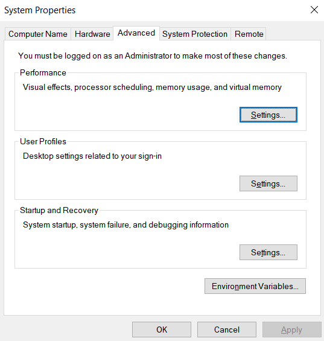
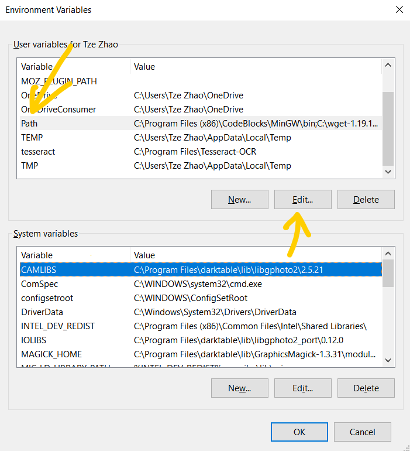
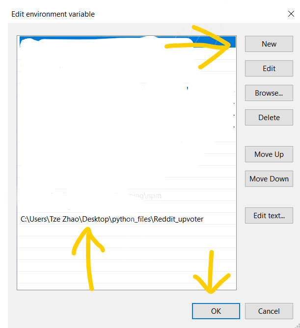

# REDDIT AUTO UPVOTER
### This program uses selenium to upvote all reddit posts on the front page.

## Dependencies:
* selenium
* Google Chrome (ver 80, ver 79 driver available at https://chromedriver.storage.googleapis.com/index.html?path=79.0.3945.36/)
* python 3.7 (may work for older versions, untested)
* a Reddit account
* Windows 10 (may work for older versions, untested, other OS drivers available at https://chromedriver.storage.googleapis.com/index.html?path=80.0.3987.16/)

## Setup
* Download the repo and move the file "chromedriver".exe to a folder of your choosing
* Copy the folder path and add it to PATH in system environmental variables

* Install selenium using pip
`C;\users\yourname>pip install selenium`

